# Intro To Honeypots

* Understanding Defensive Honeypots
* Building A Web Hive

Honeypots remain a relatively unexplored concept beyond the realms of security research organizations. This is largely due to the stigma where these types of systems are typically observed as being exploitable, therefore introducing unnecessary risk. This fear of the unknown results in lost opportunities for defenders by avoiding the topic altogether.

We will help eliminate this fear by illustrating how the strategic planning of a honeypot can not only leverage anticipated behavior from attackers but also serve as a proactive defensive measure, enabling early threat detection within a controlled environment.

## Understanding Defensive Honeypots

* What is a Honeypot?
* Utilizing Honey Tokens
* Managing The Risk
* Practicality Through Deception

### What is a Honeypot?

A honeypot is a strategically positioned system that serves a variety of purposes. These purposes range from being a decoy, deliberately exploitable, to a hardened system with extensive monitoring as well as a combination of all three.

Systems that are built to serve as a decoy are used to pull attackers away from production systems with the hopes that they waste their time and resources long enough to draw a response from defenders.

Exploitable systems are usually leveraged by security researchers as well as law enforcement as a means to research behaviors and techniques employed by attackers in the wild. These types of systems are very complex and tend to reside within a honeypot network that hides behind the veil of a shell company that doesn’t actually exist. The intent behind this is to make it more believable without raising too many alarms. Attackers will utilize similar techniques by spinning up websites with a seemingly harmless front end with the hopes that it will get categorized as a low risk site before being used to serve malicious payloads.

Most exploitable systems tend to blend in very well while some are extremely obvious with services such as RDP or SMB exposed to the internet with the intent to draw immediate attention.

There are also honeypots that exist as public services to collect and analyze various payloads. While some of these services are simply built as a means for professionals (and cyber criminals) to test the detection rate of their payloads, they are equally leveraged as a means to distribute payloads to anti-virus companies and law enforcement looking to get an edge on new techniques used in the field.

Honeypots are not only deployed as a workstation or server, but can also be a type of object planted virtually, referred to as a _honey token_. These tokens can range from intentionally exposed emails to catch phishing emails as well as objects planted in a directory service with dedicated monitoring as a means to identify instances where an attacker is enumerating Active Directory or performing a _kerberoasting_ attack for example.

In this case study we will walk through a strategy where we will be designing a system that isn’t intended to be exploitable but will be used as a honey token of sorts where we’ll monitor for and take advantage of expected behavior.

### Utilizing Honey Tokens

The type of system we will be building will utilize the strategic implementation of honey tokens, akin to that of a tripwire, that we will use to key in on targeted behavior. We will use these techniques to highlight distinct phases of an attacker's interactions with a system. With each phase that is triggered, we will be able to generate useful data during that stage of an attack.

The concept of honey tokens can realistically be incorporated into any legitimate production system but depending on the size of your organization then can lead to alert fatigue and easily become very overwhelming with the amount of chatter generated from legitimate use that needs to be filtered through. Where we will be using this on a honeypot, we have already cut the work in half as no legitimate client will be using the system.

### Managing the Risk

The first thing that typically scares people away from using honeypots is that they are afraid it will become compromised and end up causing more problems than it will solve. While we could argue this to be true for any system that is exposed to the internet, we can simply introduce the same amount of due care and attention as we would when spinning up any system that would be exposed to the internet.

The first thing we will need to do is ensure that we have a clear goal in mind so we can start building exactly what we need from start to finish. In this case study, we are going to produce a simple web server that will draw the attention away from our production systems with the lure of a false flag through a deceptive landing page and planting a fake logon portal in a hidden directory exposed through a _robots.txt_ file.

Once you have built your system, you can assess its security by performing your own penetration test, but there would be too much bias associated with the assessment. Instead, put your system to the test by exposing honeypot to a third-party penetration test to identify any unexpected vulnerabilities prior to exposing it to the internet. 

If you do this, be sure to avoid revealing the inclusion of a honeypot within the assessment scope. If you do, you will forever burn its usefulness due to significant bias that will exist from that point forward from that company. While not incredibly critical, this is a judgment call you need to make to determine what is best for your security program.

### Practicality Through Deception

One of the benefits of using a web server is that it will not raise immediate suspicion. This is because it’s more than appropriate to assume that an enterprise environment will have one or more web servers available through a demilitarized zone. 
 
It will be important to ensure that when you start building out your system that you keep it well crafted and consistent so that it blends in with what your organization currently has available or at a minimum what would be considered expected for your type of organization. For example, spinning up a banking portal when you’re a healthcare system won’t make any sense.

Keep in mind that we are all still human and humans make mistakes that tend to develop into bad habits which.is especially true with penetration testing. Most people get exposure to this field through capture-the-flag machines and lab environments that do not include security controls. This creates a false sense of security that results in gung-ho testers acting overly aggressive with their scans and attacks which will more often than not result in them falling right into the hands of a blue team.

With a better understanding of honeypots and why we are building a web server, we will go through the steps of building out a functional system.

## Building A Web Hive

* Installing Our Web Server
* Hardening Apache
* Enumeration Honey Tokens
* Authentication Honey Tokens
* Collecting Honey

We are building this system in a way that will take advantage of two activities that an attacker will usually perform against an available web application, namely enumeration and authentication. While these scenarios may seem basic, we will find that they’ll be able to provide us useful information that could be leveraged as an early detection and mitigation mechanism to identify an existing compromise or help prevent one before it occurs.

### Installing Our Web Server

For this system we are going to build an _Apache Web Server_ on top of _Ubuntu Server Minimized_ that we will name ‘support’. It goes without saying that it is important to refrain from ever using the word _honeypot_ anywhere within your server build.
 
If you happen to be using a personal lab to test, you could take advantage of the version of Apache that is already installed on Kali Linux. This way you can build and test your system locally prior to porting it over to a more permanent location.

We will start off by making sure that `/etc/apt/sources.list` is populated and then we’ll upgrade our system using the `apt` tool.

```
lab@support:~$ sudo apt update
lab@support:~$ sudo apt full-upgrade -y
```
> Listing - Installing updates on our system

Since Apache does not come pre-installed on Ubuntu Server we’ll go ahead and install the `apache2` package.

```
lab@support:~$ sudo apt install apache2
```
> Listing - Installing the Apache2 package

Next we will make sure that our service is running by using the `service` command.

```
lab@support:~$ service apache2 status
● apache2.service - The Apache HTTP Server
     Loaded: loaded (/lib/systemd/system/apache2.service; enabled; vendor preset: enabled)
     Active: active (running) since Tue 2023-08-22 15:03:27 UTC; 1min 6s ago
```
> Listing - Checking the apache2 service status

Now that we confirmed that the service is up and running we’ll check if we can browse to our web server from our browser.

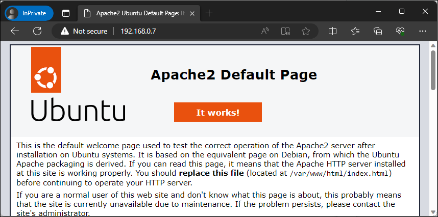
> Figure - Browsing to our default page

Up to this point we have confirmed that we have a functioning web server. Next we need to enable PHP functionality by installing the `libapache2-mod-php` package. This component is only necessary if you are planning on incorporating PHP, otherwise only install the dependencies that you need.

```
lab@support:~$ sudo apt install libapache2-mod-php
```
> Listing - Installing the libapache2-mod-php package

To confirm that our web server can now properly interpret and execute PHP code, we’ll create a simple PHP web page called `test.php` that will execute the `phpinfo()` function. If this works properly then the server will produce a page containing details about the version of PHP and other details about the environment. We will do this by running the `echo` command followed by `sudo tee` to create our page.

```
lab@support:~$ echo '<?php phpinfo(); ?>' | sudo tee /var/www/html/test.php
```
> Listing - Creating a PHP test web page

Now we’ll browse to this page similar as before, except we’ll include the name of the file we just created in the URL.

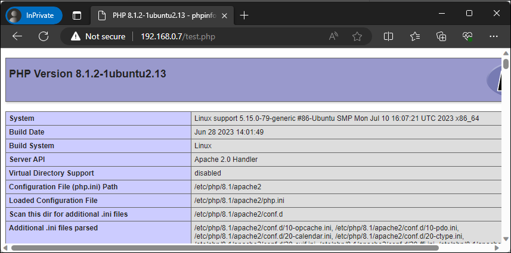
> Figure - Browsing to our PHP test page

Next we will need to enable the `headers` module using the `a2enmod` command. This module will allow us to control headers from both incoming client requests and outgoing server responses.

```
lab@support:~$ sudo a2enmod headers
```
> Listing - Enabling the apache headers module

Finally, we will install the `ModSecurity` package. This module is an addon that acts as a web application firewall that will provide additional protection for our web server based on a set of configured rules. We will follow up on its configuration in the next section.

```
lab@support:~$ sudo apt install libapache2-mod-security2
```
> Listing - Installing the libapache2-mod-security2 package

We have finished installing all of our prerequisites for our web server. In the next section we will focus on hardening this install beyond the Apache defaults.

### Hardening Apache

Out of the box, Apache is relatively locked down, but there are opportunities for improvement. The following steps will give you a general baseline that works well with this specific use case, however, you should always research additional ways to harden your system that works well for your specific use case. 

To start things off we’ll clean out our web root `/var/www/html` of all the default and test files we created during our install.

```
lab@support:~$ sudo rm /var/www/html/*
```
> Listing - Purging our web root

Now we’ll browse back to our web page to make sure it reflects on this change.

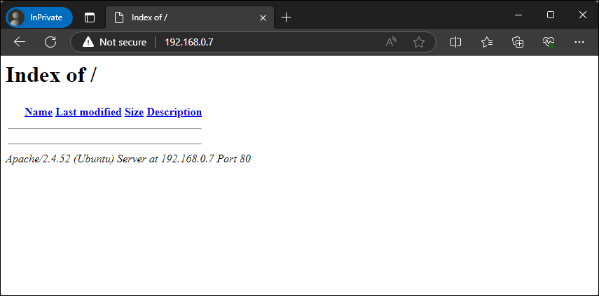
> Figure - Browsing our web server with directory browsing enabled

In this case we see a directory listing of our web root, albeit it’s currently empty. This is expected behavior since we deleted the `index.html` file. This functionality will be addressed shortly. 

One of the items that you have likely noticed is that our web page is also revealing sensitive information, specifically the version of Apache and OS details, which can be quite valuable to an attacker. Another way this information can be retrieved is through the use of the `whatweb` tool included on Kali Linux against our web server. 

```
┌──(kali㉿kali)-[~]
└─$ whatweb http://192.168.0.7 
http://192.168.0.7 [200 OK] Apache[2.4.52], Country[RESERVED][ZZ], HTTPServer[Ubuntu Linux][Apache/2.4.52 (Ubuntu)], IP[192.168.0.7], Index-Of, Title[Index of /]
```
> Listing - Running the whatweb tool against our web server

In addition to this, if we were to browse a page that doesn’t exist, the server-generated pages would also include sensitive information. 


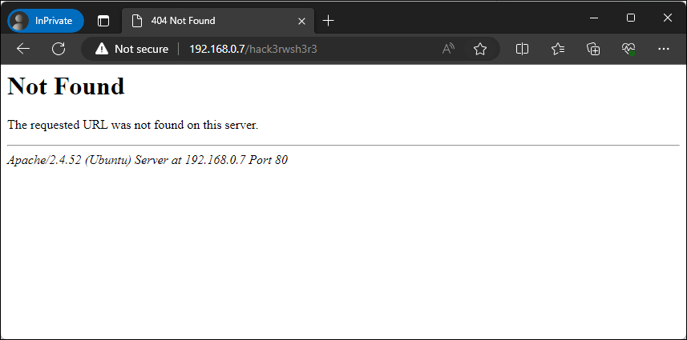
> Figure - Details exposed with non-existent page

We can mitigate these risks by modifying a couple of the Apache configuration files. The first one we will modify is the `/etc/apache2/conf-available/security.conf` file which will help limit the amount of data that is shared about the web service.

We’ll modify this file by changing the value for the `ServerTokens` directive from ‘OS’ to ‘Prod’ using the `sed` command.

```
lab@support:~$ sed -i 's/ServerTokens OS/ServerTokens Prod/' /etc/apache2/conf-available/security.conf
```
> Listing - Modifying the ServerTokens directive

Now we will limit the system information that is displayed on server-generated pages by changing the `ServerSignature` directive from `On` to `Off` within the same file.

```
lab@support:~$ sudo sed -i 's/ServerSignature On/ServerSignature Off/' /etc/apache2/conf-available/security.conf
```
> Listing - Modifying the ServerSignature directive

Now let’s save our modified config file and restart the web service. 

```
lab@support:~$ sudo service apache2 restart
```
> Listing - Restarting the apache2 service

With the service back up and using our updated settings, we will rerun our `whatweb` command to verify that the discrete versioning info has been restricted.

```
┌──(kali㉿kali)-[~]
└─$ whatweb http://192.168.0.7
http://192.168.0.7 [200 OK] Apache, Country[RESERVED][ZZ], HTTPServer[Apache], IP[192.168.0.7], Index-Of, Title[Index of /]
```
> Listing - Running whatweb against our web server

Perfect, this time we are not getting specific server information anymore. Although _Apache_ is revealed, this isn’t much of a big deal as opposed to the exact version number. Next we will browse back to an invalid page to ensure server details are no longer being displayed. 

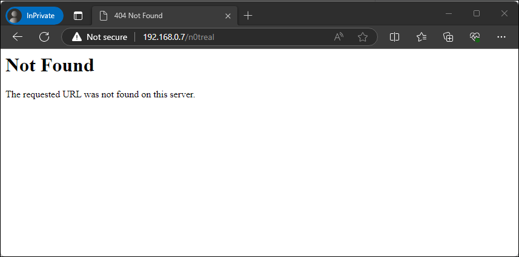
> Figure - Details no longer exposed with non-existent page

Now we will modify default accessibility options that are made available within the `/etc/apache2/apache2.conf` file, such as directory and file access controls and available HTTP methods. We will control these by modifying the `<Directory>` blocks within this file.  

By default there are three directories named in this file, namely the file system root, user share and the web directory. Let's take a look at the default settings so we can better understand what’s being allowed by default.

```
<Directory />
        Options FollowSymLinks
        AllowOverride None
        Require all denied
</Directory>

<Directory /usr/share>
        AllowOverride None
        Require all granted
</Directory>

<Directory /var/www/>
        Options Indexes FollowSymLinks
        AllowOverride None
        Require all granted
</Directory>
```
> Listing - Default apache2.conf directory block settings

The `<Directory />` section applies to the entire file system and contains three rules.

1. Options FollowSymLinks
2. AllowOverride None
3. Require all denied 

The rule `Options FollowSymLinks` enables the ability for the web service to follow symbolic links. The rule `AllowOverride None` disables the processing of `.htaccess` files from that location. The rule `Require all denied` denied access to that directory for the web service account. Although access is denied, it still enables `OPTIONS` support for Symbolic links. While not necessarily critical for our use case, we’ll still explicitly deny it by changing it to `Options None`.

```
<Directory />
        Options None
        AllowOverride None
        Require all denied
</Directory>
```
> Listing - Blocking all options for the file system root
	
The `<Directory /usr/share>` section applies to the user share directory and contains two rules.

1. AllowOverride None
2. Require all granted

Like we saw below, this rule disables `.htaccess` processing but allows access to the `/usr/share` directory which by default is world-readable on a linux system.. This is useful when there are circumstances where there is data within `/usr/share` that you want to be made accessible to your web service. With this specific use case we do not need it so we’ll disable it by changing `granted` to `denied`. We will also include `Options None`.

```
<Directory /usr/share>
        Options None
        AllowOverride None
        Require all denied
</Directory>
```
> Listing - Disabling access to /usr/share

The `<Directory /var/www/>` section applies to the document root for the web service which contains three rules.

1. Options Indexes FollowSymLinks
2. AllowOverride None
3. Require all granted	

This rule allows directory browsing as well as the ability to follow symbolic links, as directory with the inclusion of both `Indexes` and `FollowSymLinks`. In addition to what we have already seen, it does not enable `.htaccess` processing and grants access for the web service to that location. We are going to lock this down similarly to before by changing the options value to `Options None`. 

```
<Directory /var/www/>
       Options None
       AllowOverride None
       Require all granted
</Directory>
```
> Listing - Disabling directory browsing and symbolic links

Now we’ll limit the availability of HTTP methods which are managed within the same blocks we just took a look at. First, we will verify what options are listed as available on our server by running `nmap` the `http-methods` script.

```
──(kali㉿kali)-[~]
└─$ nmap 192.168.0.7 -p 80 --script http-methods
Starting Nmap 7.94 ( https://nmap.org ) at 2023-08-22 12:11 EDT
Nmap scan report for 192.168.0.7
Host is up (0.00096s latency).
PORT   STATE SERVICE
80/tcp open  http
| http-methods: 
|_  Supported Methods: GET POST OPTIONS HEAD

Nmap done: 1 IP address (1 host up) scanned in 0.27 seconds
```
> Listing - Running the http-methods nse script

In this case we can see that `GET`, `POST`, `OPTIONS` and `HEAD` are currently available. In order for us to lock this down, we will include the use of a `LimitExcept` clause to grant explicit access to named methods.

```
<Directory /var/www/>
        <LimitExcept GET POST>
            Order deny,allow
            Deny from all
        </LimitExcept>
        Options None
        AllowOverride None
        Require all granted
</Directory>
```
> Listing - Explicitly allowing GET and POST methods and blocking all others.

This logic explicitly allows the use of `GET` and `POST` and instructs the Apache2 to process the deny logic first, then denies all other methods. Due note that the `HEAD` method is allowed as  it is inherited with the inclusion of `GET`.

The final settings we will address pertain to the lack of configured headers which can introduce browser-related vulnerabilities. While not necessarily critical for this use case since no legit users will be browsing to this web server, it is still useful to know.

First we will need to enable the `headers` module we installed earlier using the `a2enmod` command then we’ll need to restart the web service.

```
lab@support:~$ sudo a2enmod headers
```
> Listing > Enabling the apache headers module

Now we will disable the inclusion of frames to prevent clickjacking by removing the comment from the `Header set X-Frame-Options: "sameorigin` setting in `/etc/apache2/conf-available/security.conf`. 

```
lab@support:~$ sudo sed -i 's/#Header set X-Frame-Options: "sameorigin"/Header set X-Frame-Options: "sameorigin"/' /etc/apache2/conf-available/security.conf
```
> Listing - Prevent clickjacking

Next we will prevent MIME from interpreting files as something else than declared by the content type in the HTTP headers.

```
lab@support:~$ sudo sed -i 's/#Header set X-Content-Type-Options: "nosniff"/Header set X-Content-Type-Options: "nosniff"/' /etc/apache2/conf-available/security.conf
```
> Listing - Prevent MIME type manipulation

Putting this all together our final configuration should look like this:  

```
<Directory />
        Options None
        AllowOverride None
        Require all denied
</Directory>

<Directory /usr/share>
	Options None        
      AllowOverride None
      Require all denied
</Directory>

<Directory /var/www/>
        <LimitExcept GET POST>
            Order deny,allow
            Deny from all
        </LimitExcept>
        Options None
        AllowOverride None
        Require all granted
</Directory>
…
Header always append X-Frame-Options DENY
Header always set X-Content-Type-Options nosniff
```
> Listing - Final modified apache2.conf settings

We are nearing the end of our hardening efforts and all that’s left for now is to complete the configuration of the ModSecurity module that we installed earlier. The default configuration file for this module is located at `/etc/modsecurity/modsecurity.conf-recommended` which we’ll need to rename for it to affect by removing `-recommended` from the end of the file name. 

We will simply make a copy of this so we will have a backup of the original file.

```
lab@support:~$ sudo cp /etc/modsecurity/modsecurity.conf-recommended /etc/modsecurity/modsecurity.conf
```
> Listing - Creating a production copy of modsecurity.conf

This system comes with a set of default rules that will provide decent protection security which includes rulesets from the OWASP project (https://owasp.org/www-project-modsecurity-core-rule-set/).

We will be making a modification by adding an exclusion to give our lazy attackers a helping hand by disabling rule `913100`. This rule contains logic to look for common keywords in the user agent field such as `gobuster` and `hydra` and will block responses to requests with those keywords in the agent field. Although seasoned penetration testers will spoof their user agent anyways we want to make sure don’t lose out on data from those who choose not to do so. 

We’ll append the `/etc/modsecurity/crs/RESPONSE-999-EXCLUSION-RULES-AFTER-CRS.conf` configuration file and add our exclusion by the detection id. 

```
lab@support:~$ echo -e "# Do not block requests from tools like hydra and gobuster\nSecRuleRemoveById 913100" | sudo tee /etc/modsecurity/crs/RESPONSE-999-EXCLUSION-RULES-AFTER-CRS.conf -a
```
> Listing - Excluding rule id 913100 within modsecurity

Now we will turn our attention to the default config file which only requires one step for us to take. The default configuration instructs the module to only detect threats and to not take any action against them. 

This setting is controlled by the `SecRuleEngine` directive that is set to ‘DetectionOnly’. We will need to change this to ‘On’ it will detect and block traffic.

```
lab@support:~$ sudo sed -i 's/SecRuleEngine DetectionOnly/SecRuleEngine On/' /etc/modsecurity/modsecurity.conf
```
> Listing - Configuring ModSecurity to detect and block traffic

With all of our changes made we’ll restart our web service and go back through our previous steps to ensure that our server has been locked down appropriately. We will start by simply attempting to browse to our page again.

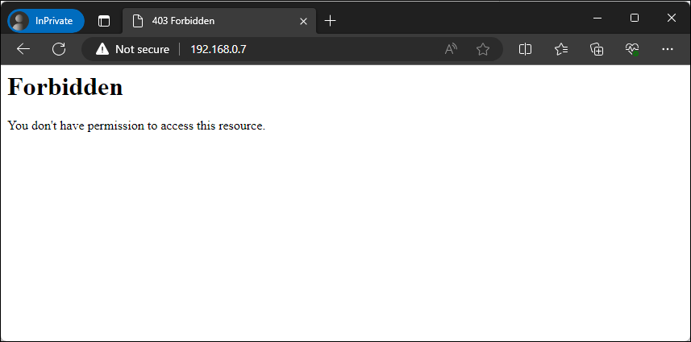
> Figure - Browsing to our web server with forbidden access

We can now no longer view a directory listing of the web root. Now we’ll re-run our nmap command from before to ensure our HTTP methods are locked down.

```
┌──(kali㉿kali)-[~]
└─$ nmap 192.168.0.7 -p 80 --script http-methods
Starting Nmap 7.94 ( https://nmap.org ) at 2023-08-22 12:14 EDT
Nmap scan report for 192.168.0.7
Host is up (0.0014s latency).
PORT   STATE SERVICE
80/tcp open  http

Nmap done: 1 IP address (1 host up) scanned in 0.22 seconds
```
> Listing - Verifying that HTTP methods have been disabled

We do not see the supported methods that were shown earlier, which is good. Do note that if we were not using ModSecurity then this output would reveal POST as an available method. Now we’ll perform a sanity check by running a scan against our web server using the `nikto` tool on Kali Linux.

```
┌──(kali㉿kali)-[~]
└─$ nikto -host http://192.168.0.7 -C all
- Nikto v2.5.0
---------------------------------------------------------------------------
+ Target IP:          192.168.0.7
+ Target Hostname:    192.168.0.7
+ Target Port:        80
+ Start Time:         2023-08-22 12:57:50 (GMT-4)
---------------------------------------------------------------------------
+ Server: Apache
+ 26640 requests: 0 error(s) and 0 item(s) reported on remote host
+ End Time:           2023-08-22 12:58:39 (GMT-4) (49 seconds)
---------------------------------------------------------------------------
+ 1 host(s) tested
```
> Listing - Scanning our web server using Nikto

This didn’t produce any output which tells us we have configured our header controls properly whereas those headers would’ve been the first two findings in most cases.

Great work, at this point we have installed Apache and hardened the default configuration which has provided us with a solid foundation from which we can start building our honey tokens into the web server.

### Enumeration Honey Tokens

The first honey token we will be planting on our web server will be used when attackers scan or enumerate the system for accessible files, directories and other useful information.

While this is something we could use on any other production web server, those logs will become cluttered with traffic from both expected and unexpected sources, such as from driveby bots and other online scanning services. This makes it more difficult to differentiate between what’s critical or not without creeping on alert fatigue.

Since this is a honeypot, we already know that anyone browsing is not an actual user which immediately removes that unknown from the equation. This is hardly a smoking gun since bot traffic is a guarantee so we’ll need to introduce multiple levels for us to focus on to help cut down on some of the initial chatter that we may not initially care about. 

We will stand up a simple landing page that will entice the curiosity of whomever is browsing the web server. Let’s take a look at the following HTML file we’ll be using as the index for our web root.

```
<!DOCTYPE html>
<html lang="en">
<head>
    <meta charset="UTF-8">
    <meta name="viewport" content="width=device-width, initial-scale=1.0">
    <title>Website Under Development</title>
    <style>
        body {
            font-family: Arial, sans-serif;
            text-align: center;
            background-color: #f4f4f4;
            margin: 0;
            padding: 0;
        }
        .container {
            padding: 100px;
        }
        h1 {
            color: #333;
        }
        p {
            color: #777;
        }
    </style>
</head>
<body>
    <div class="container">
        <h1>Website Under Development</h1>
        <p>This support portal is our test instance and should not be used in production.</p>
        <p>Please report any issues you encounter with the engineering team at <a href="mailto:support@company.com">support@company.com</a>.</p>
    </div>
</body>
</html>
```
> Listing - Content of our web root index.html file

This page contains three components, a style sheet that will control the formatting and color of our page, the message that we want to display and an email address. We will save this file to `/var/www/html/index.html` and browse to it to see how it looks.

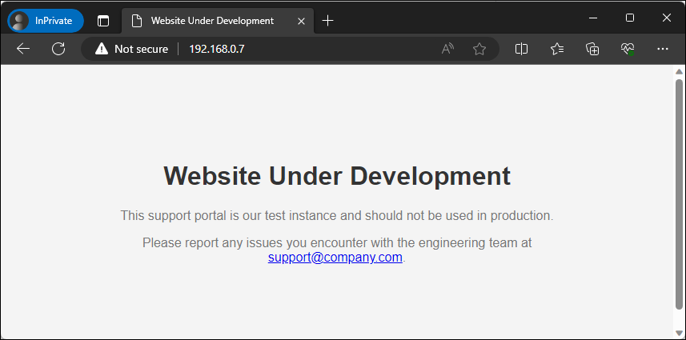
> Figure - Browsing to our web root landing page

While crude, most attackers are sensitized by the eye candy of ‘development’, ‘test’ and ‘portal’ buzzwords as an easy indicator that something interesting lies beyond this page.

Another component we will take advantage of is planting an email address onto this page. If you have a workflow where you have the capability to centralize the process to analyze and respond to phishing emails then you can assume that every email sent to this mailbox is not legit and should be subject to analysis.

With our landing page setup, we now need to introduce a hidden directory that will only be discoverable through an entry we will add to a `robots.txt` file that will be placed in the web root. Although the _ethical_ crawlers will honor the contents of this file, attackers will take advantage of this file looking to find a quick win. 

To ensure that our new directory is only discoverable from this file we will use a simple script to check whether or not the directory path exists in any of the included Kali Linux wordlists. We will improve upon this by casting a wider net by installing the `seclists` package to add additional wordlists for us to sift through.

```
┌──(kali㉿kali)-[~]
└─$ sudo apt install seclists
```
> Listing - Installing the seclists package

With the seclists package now installed, we’ll save the following PowerShell script on our Desktop and call it `isDiscoverable.ps1`.

```
$word = "devuseonly"
$wordlists = "/usr/share/wordlists"
$files = Get-ChildItem -Path $wordlists -Recurse -Include *.lst,*.txt
foreach ($file in $files) {
    if (Select-String -Path $file.FullName -Pattern $word -Quiet)
{
        Write-Host "$word is discoverable within $($file.FullName)"
        $found = $true
        break
    }
}
if (-not $found) {
    Write-Host "$word does not exist in the accessible wordlists"
}
```
> Listing - Contents of the isDiscoverable powershell script

This script contains a couple of components. We are storing the word we are looking for and the path to the wordlist directory in two variables. Then we are using the `Get-ChildItem` cmdlet to recursively grab all the `lst` and `txt` files that exist within the named path. Then we’re using a `foreach` loop to go through every file to search for the word we are looking for. 

If the word is found it will stop processing and output the file that contains our word. If it doesn’t, then it will output that it’s not currently accessible in those wordlists. At the time of writing this post, the word ‘devuseonly’ does not exist and the script took about 15 seconds to complete. Let’s go ahead and run this using `pwsh`. 

```
┌──(kali㉿kali)-[~]
└─$ pwsh Desktop/isDiscoverable.ps1
devuseonly does not exist in the accessible wordlists
```
> Listing - Running our isDiscoverable.ps1 script

With confidence that our designated word is unique, we will create our robots.txt file in our web root with a `Disallow` statement for the `/devuseonly/` directory.

```
lab@support:~$ echo -e "User-agent: *\nDisallow: /devuseonly/" | sudo tee /var/www/html/robots.txt
```
> Listing - Creating our robots.txt file

Then we’ll create the aforementioned subdirectory and a basic landing page that will act as a placeholder as it’ll be replaced in the next section.

```
lab@support:~$ sudo mkdir /var/www/html/devuseonly/
lab@support:~$ echo -e "Working!" | sudo tee /var/www/html/devuseonly/index.html
```
> Listing - Planting our secret web directory

Let’s run a quick test to make sure everything is accessible. First we will browse directly to the robots.txt file.

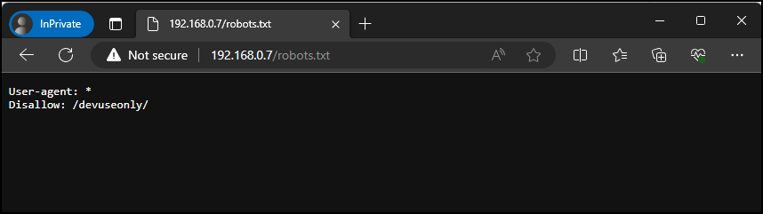
> Figure - Browsing to our robots.txt file

Then we’ll browse directly to the `devuseonly` directory.

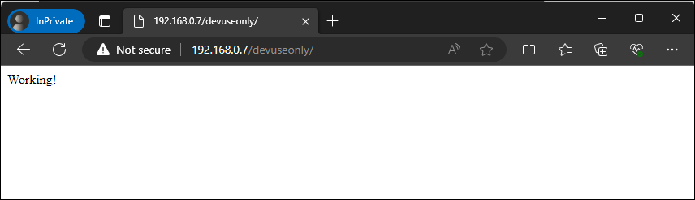
> Figure - Browsing to our devuseonly directory

Great, our hidden directory is working as expected. At this point we have successfully created a landing page designed to encourage an attacker to try harder and attempt to discover additional pages that may be accessible along with an email address for them to attempt to phish. We have also planted a hidden directory that is only accessible if an attacker disobeys the robots.txt directive.

### Authentication Honey Tokens

Now that we have an accessible hidden directory, we will now add the components needed for a logon portal. The lure for this stage that we are hoping for is that an attacker will think that we let our guard down by having a non-production portal with some form of authentication available from the internet and therefore would be more willing to attempt to use a variety of password attacks.

We will be repurposing an attacker toolset for defensive purposes by implementing a credential harvester that will keep a log of every set of credentials that are sent through our logon form. Let’s take a look at what this page would look like when viewed from our browser.

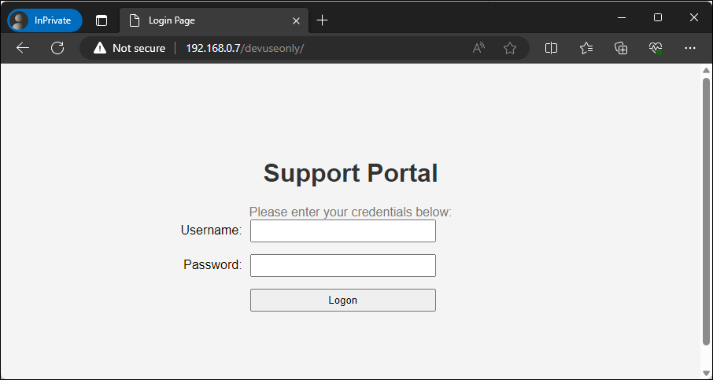
> Figure - Viewing our support portal page

This presents us with a very basic login form. If we attempt to pass credentials through the form the page will process the request and after a few seconds will let us know that the credentials were incorrect.

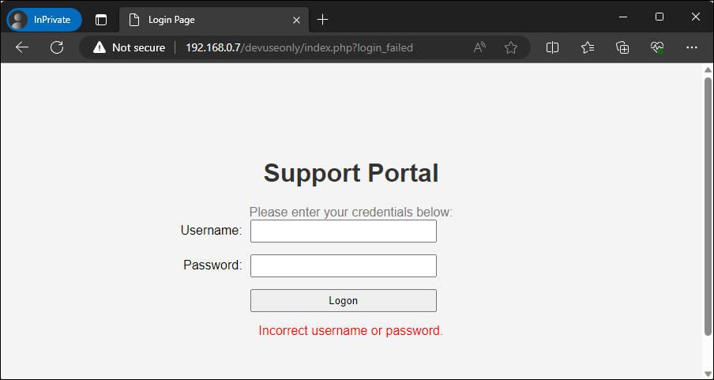
> Figure - Viewing our support portal after invalid credentials

With a better understanding of the front-end experience, let’s take a look at the components of the code that form this functionality. First we are introducing another style sheet to ensure that there’s consistency by matching the existing color scheme and formatting between this page and the initial landing page.

```
<style>
        body {
            font-family: Arial, sans-serif;
            text-align: center;
            background-color: #f4f4f4;
            margin: 0;
            padding: 0;
        }
        .container {
            padding: 100px;
        }
        h1 {
            color: #333;
        }
        p {
            color: #777;
            margin: 0;
        }
        .login-form {
            margin-top: 20px;
        }
        .form-group {
            margin-bottom: 15px;
            display: flex;
            align-items: center;
            justify-content: center;
        }
        .form-group label {
            flex-basis: 30%;
            text-align: right;
            margin-right: 10px;
        }
        .form-group input,
        .form-group button {
            flex: 1;
            padding: 5px;
            max-width: 50%;
            box-sizing: border-box;
        }
        .form-label {
            flex-basis: 30%;
        }
        .form-controls {
            flex: 1;
            display: flex;
            justify-content: space-between;
            align-items: center;
        }
        .error-message {
            color: red;
            margin-top: 10px;
        }
    </style>
```
> Listing - HTML style sheet for login form

Then we are adding a simple HTML login form with fields for a username, password and a button as well as a form action to call `post.php`. The inclusion of this form action is critical as a savvy attacker will view the source code and if they don’t see any valid components that would make up a typical authentication process they will be wary of moving forward. 

```
<form class="login-form" action="post.php" method="post">
            <p>Please enter your credentials below:</p>
            <div class="form-group">
                <label class="form-label" for="username">Username:</label>
                <div class="form-controls">
                    <input type="text" id="username" name="username" required>
                </div>
            </div>

            <div class="form-group">
                <label class="form-label" for="password">Password:</label>
                <div class="form-controls">
                    <input type="password" id="password" name="password" required>
                </div>
            </div>

            <div class="form-group">
                <label class="form-label"></label>
                <div class="form-controls">
                    <button type="submit" name="login">Logon</button>
                </div>
            </div>
        </form>

```
> Listing - HTML login form for our supportal portal

Now this is where we start getting sneaky with our inclusion of PHP. Our landing page will only contain the following snippet of PHP that will look to see if the url parameter `login_failed’ was included when the page was loaded and if so, display the text for incorrect credentials.

```
<?php
        if (isset($_GET['login_failed'])) {
            echo '<div class="error-message">Incorrect username or password.</div>';
        }
?>
```
> Listing - PHP code to display incorrect username or password
While that code is more so added here to keep our page appear more realistic, the devious activity occurs within our post.php page which is displayed in the listing below.
```
<?php
// Sleep for two seconds to simulate validation
sleep(2);

// Capture client info
$ip = 'Remote IP: ' . $_SERVER['REMOTE_ADDR'];
if (isset($_SERVER['HTTP_X_FORWARDED_FOR']) && filter_var($_SERVER['HTTP_X_FORWARDED_FOR'], FILTER_VALIDATE_IP)) {
    $ip = 'Proxied IP: ' . $_SERVER['HTTP_X_FORWARDED_FOR'];
} elseif (isset($_SERVER['HTTP_CLIENT_IP']) && filter_var($_SERVER['HTTP_CLIENT_IP'], FILTER_VALIDATE_IP)) {
    $ip = 'Client IP: ' . $_SERVER['HTTP_CLIENT_IP'];
}

// Capture form data
$user_agent = substr($_SERVER['HTTP_USER_AGENT'], 0, 500);
$username = substr($_POST["username"] ?? '', 0, 100);
$password = substr($_POST["password"] ?? '', 0, 100);

// Check if both username and password are not empty
if (!empty($username) || !empty($password)) {
    // Prepare the log entry
    $timestamp = date('Y-m-d H:i:s');
    $entry = "$timestamp | Username: $username | Password: $password | $ip | Agent: $user_agent\r\n";

    // Append to the entry to the log file
    $file = '/var/www/logons.txt';
    file_put_contents($file, $entry, FILE_APPEND);
}

// Redirect the client back to the landing page
header("Location: http://192.168.0.7/devuseonly/index.php?login_failed");
exit;
?>
```
> Listing - Contents of our post.php file

The first action that will take place is the page will sleep for 2 seconds to simulate a web server attempting to validate credentials. Once that is complete, it will obtain and store the client ip address that is available within any of the named headers as well as a timestamp, username, password and append it to a log file. Although modsecurity will provide some protections against large form submissions we will add some server-side validation to limit how much data our post.php will save in our log file by grabbing the first 100 characters in the username and password field and the first 500 characters from the user agent field.

It is important to make sure that this file is not accessible from the web server so you do not burn the contents of this file which will raise immediate suspicion. By default the document root is `/var/www/html`.

For now we will create the log at `/var/www/logons.txt` and apply the necessary permissions for the `www-data` account.

```
lab@support:~$ sudo touch /var/www/logons.txt
lab@support:~$ sudo chown www-data:www-data /var/www/logons.txt
lab@support:~$ sudo chmod 644 /var/www/logons.txt
```
> Listing - Creating our log file for authentication attempts

Now that we know how everything works, we’ll save the listing for our post.php file to `/var/www/html/devuseonly/post.php`. Then we will save the contents of the listing below to `/var/www/html/devuseonly/index.php` and restart our web service.

```
<!DOCTYPE html>
<html lang="en">
<head>
    <meta charset="UTF-8">
    <meta name="viewport" content="width=device-width, initial-scale=1.0">
    <title>Login Page</title>
    <style>
        body {
            font-family: Arial, sans-serif;
            text-align: center;
            background-color: #f4f4f4;
            margin: 0;
            padding: 0;
        }
        .container {
            padding: 100px;
        }
        h1 {
            color: #333;
        }
        p {
            color: #777;
            margin: 0;
        }
        .login-form {
            margin-top: 20px;
        }
        .form-group {
            margin-bottom: 15px;
            display: flex;
            align-items: center;
            justify-content: center;
        }
        .form-group label {
            flex-basis: 30%;
            text-align: right;
            margin-right: 10px;
        }
        .form-group input,
        .form-group button {
            flex: 1;
            padding: 5px;
            max-width: 50%;
            box-sizing: border-box;
        }
        .form-label {
            flex-basis: 30%;
        }
        .form-controls {
            flex: 1;
            display: flex;
            justify-content: space-between;
            align-items: center;
        }
        .error-message {
            color: red;
            margin-top: 10px;
        }
    </style>
</head>
<body>
    <div class="container">
        <h1>Support Portal</h1>
        <form class="login-form" action=post.php method="post">
            <p>Please enter your credentials below:</p>
            <div class="form-group">
                <label class="form-label" for="username">Username:</label>
                <div class="form-controls">
                    <input type="text" id="username" name="username" required>
                </div>
            </div>

            <div class="form-group">
                <label class="form-label" for="password">Password:</label>
                <div class="form-controls">
                    <input type="password" id="password" name="password" required>
                </div>
            </div>

            <div class="form-group">
                <label class="form-label"></label>
                <div class="form-controls">
                    <button type="submit" name="login">Logon</button>
                </div>
            </div>
        </form>
        <?php
        if (isset($_GET['login_failed'])) {
            echo '<div class="error-message">Incorrect username or password.</div>';
        }
        ?>
    </div>
</body>
</html>
```
> Listing - Our complete index.php file

With everything in place, let's go ahead and attempt a login and make sure that everything is working and that our logon attempt has been logged.

```
lab@support:~$ cat /var/www/logons.txt
Username: blueteamers | Password: havemorefun | Remote IP: 2023-08-23 12:19:27 | 192.168.0.4 | Agent: Mozilla/5.0 (Windows NT 10.0; Win64; x64) AppleWebKit/537.36 (KHTML, like Gecko) Chrome/116.0.0.0 Safari/537.36 Edg/116.0.1938.54
```
> Listing - Verifying our test logon was logged

Fantastic, our login portal is working as expected and we can collect credentials that are sent through the form. 

### Collecting Honey

With our honeypot build complete, now we will see how we can take advantage of this system. Throughout this narrative we will assume the role of an attacker and defender. Before we get started, let's go ahead and purge our log files so we’ll work with a clean state.

```
lab@support:~$ sudo truncate /var/log/apache2/access.log -s 0
lab@support:~$ sudo truncate /var/log/apache2/error.log -s 0
lab@support:~$ sudo truncate /var/www/logons.txt -s 0
```
> Listing - Purging the log files

At some point, an attacker will typically browse to the page to obtain their bearings once a nmap scan or similar tool identifies this system as being accessible.

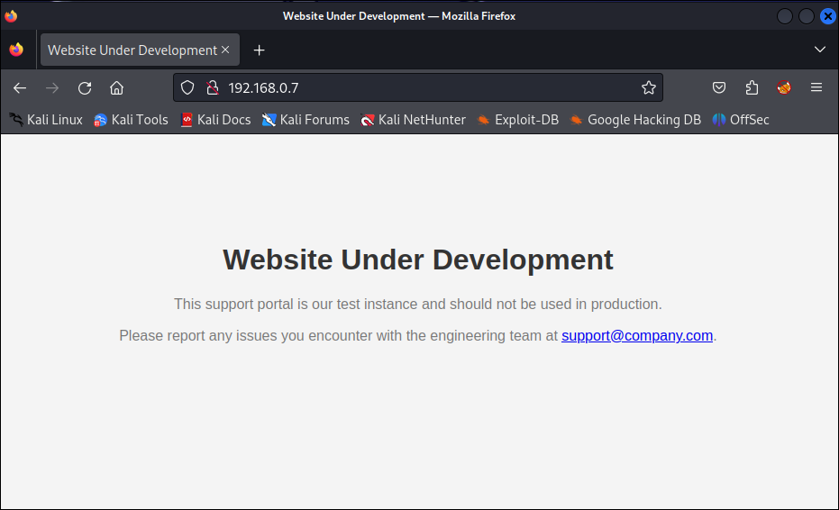
> Figure - Attacker viewing the landing page

From an attacker viewpoint we have immediately learned two things:

1. There is a test/development system available through a DMZ which was likely not intended and may have fewer controls than a production system

2. An email address has been exposed that I could attempt to send phishing emails to

From the defender viewpoint I can identify that someone has browsed our honeypot system by viewing the `/var/www/log/apache2/access.log` file. This will be extremely common and does not warrant an immediate response, but at a minimum you have collected an ip address that you know is not from any sort of legitimate use. 

```
lab@support:~$ tail -f /var/log/apache2/access.log
192.168.0.4 - - [23/Aug/2023:18:32:14 +0000] "GET / HTTP/1.1" 200 844 "-" "Mozilla/5.0 (Windows NT 10.0; Win64; x64) AppleWebKit/537.36 (KHTML, like Gecko) Chrome/116.0.0.0 Safari/537.36 Edg/116.0.1938.54"
```
> Listing - Identifying initial access to the web server

While we know that we have no concerns with the inclusion of that email address on this web page we can assume that at some point someone will send an email to it. Now at some point the attacker is going to learn that there is nothing else usable from this landing page and will attempt to identify other accessible pages by using a tool such as `gobuster`. We will run this against the web page to see if we identify any other available resources using a simple wordlist.

```
┌──(kali㉿kali)-[~]
└─$ gobuster dir -e -u http://192.168.0.7/ -w /usr/share/wordlists/dirb/common.txt
===============================================================
Gobuster v3.5
by OJ Reeves (@TheColonial) & Christian Mehlmauer (@firefart)
===============================================================
[+] Url:                     http://192.168.0.7/
[+] Method:                  GET
[+] Threads:                 10
[+] Wordlist:                /usr/share/wordlists/dirb/common.txt
[+] Negative Status codes:   404
[+] User Agent:              gobuster/3.5
[+] Expanded:                true
[+] Timeout:                 10s
===============================================================
2023/08/23 14:32:57 Starting gobuster in directory enumeration mode
===============================================================
http://192.168.0.7/.bash_history        (Status: 403) [Size: 199]
http://192.168.0.7/.hta                 (Status: 403) [Size: 199]
http://192.168.0.7/.config              (Status: 403) [Size: 199]
http://192.168.0.7/.bashrc              (Status: 403) [Size: 199]
http://192.168.0.7/.htaccess            (Status: 403) [Size: 199]
http://192.168.0.7/.git/HEAD            (Status: 403) [Size: 199]
http://192.168.0.7/.mysql_history       (Status: 403) [Size: 199]
http://192.168.0.7/.htpasswd            (Status: 403) [Size: 199]
http://192.168.0.7/.profile             (Status: 403) [Size: 199]
http://192.168.0.7/.sh_history          (Status: 403) [Size: 199]
http://192.168.0.7/.svn/entries         (Status: 403) [Size: 199]
http://192.168.0.7/_vti_bin/_vti_aut/author.dll (Status: 403) [Size: 199]
http://192.168.0.7/_vti_bin/_vti_adm/admin.dll (Status: 403) [Size: 199]
http://192.168.0.7/_vti_bin/shtml.dll   (Status: 403) [Size: 199]
http://192.168.0.7/akeeba.backend.log   (Status: 403) [Size: 199]
http://192.168.0.7/awstats.conf         (Status: 403) [Size: 199]
http://192.168.0.7/development.log      (Status: 403) [Size: 199]
http://192.168.0.7/global.asax          (Status: 403) [Size: 199]
http://192.168.0.7/global.asa           (Status: 403) [Size: 199]
http://192.168.0.7/index.html           (Status: 200) [Size: 905]
http://192.168.0.7/main.mdb             (Status: 403) [Size: 199]
http://192.168.0.7/php.ini              (Status: 403) [Size: 199]
http://192.168.0.7/production.log       (Status: 403) [Size: 199]
http://192.168.0.7/robots.txt           (Status: 200) [Size: 37]
http://192.168.0.7/server-status        (Status: 403) [Size: 199]
http://192.168.0.7/spamlog.log          (Status: 403) [Size: 199]
http://192.168.0.7/thumbs.db            (Status: 403) [Size: 199]
http://192.168.0.7/Thumbs.db            (Status: 403) [Size: 199]
http://192.168.0.7/web.config           (Status: 403) [Size: 199]
http://192.168.0.7/WS_FTP.LOG           (Status: 403) [Size: 199]
```
> Listing - Running gobuster against our web server

The scan completed and it revealed the availability of both `http://192.168.0.7/robots.txt` and `http://192.168.0.7/index.html`. Depending on the wordlists used and the number of attackers interacting with the system our access.log will start to get very large very quickly. The wordlist we used previously contains over 4000 entries so expect at a minimum 4000 lines of access attempts.

```
lab@support:~$ tail -f /var/log/apache2/access.log
192.168.0.4 - - [23/Aug/2023:18:32:14 +0000] "GET / HTTP/1.1" 200 844 "-" "Mozilla/5.0 (Windows NT 10.0; Win64; x64) AppleWebKit/537.36 (KHTML, like Gecko) Chrome/116.0.0.0 Safari/537.36 Edg/116.0.1938.54"
192.168.0.6 - - [23/Aug/2023:18:32:57 +0000] "GET / HTTP/1.1" 200 788 "-" "gobuster/3.5"
192.168.0.6 - - [23/Aug/2023:18:32:57 +0000] "GET /88fc33f4-ac7e-4e9c-b1cd-b644b36e33bc HTTP/1.1" 404 397 "-" "gobuster/3.5"
```
> Listing - Identifying directory scanning against our web server

This is nothing to be surprised of at this stage, but we can still leverage the data that has been made accessible to us. For example, we can generate a list of every ip that has accessed our web server but has not accessed our hidden page using a combination of  `grep`, `awk` and `sort`. 

```
lab@support:~$ grep -v '/devuseonly/' "/var/log/apache2/access.log" | awk '{print $1}' | sort -u
192.168.0.4
192.168.0.6
192.168.0.7
192.168.0.13
```
> Listing - Identifying ip addresses that have scanned our system

At this point we need to decide if we want to take any sort of action against these addresses, such as reporting them to an ip abuse database, block them all together or allow them to continue. For now we will perform a similar search to make sure no one has attempted to access our portal yet.

```
lab@support:~$ grep '/devuseonly/' "/var/log/apache2/access.log" | awk '{print $1}' | sort -u
```
> Listing - Identifying no ip addresses that have accessed devuseonly

This didn’t return any results so we know we don’t have an aggressive attacker yet but we can still take advantage of the data we have available by building our own wordlist of directories attackers are trying.

```
lab@support:~$ awk '{split($7, path, /\//); for (i=2; i<=length(path); i++) { if (path[i] != "") print path[i] }}' /var/log/apache2/access.log | sort -u
```
> Listing - Building a directory wordlist using awk

Now we will return to the attacker perspective. The only piece of information that was really useful from that scan was the availability of the robots.txt file which we’ll access using a curl command. 

```
──(kali㉿kali)-[~]
└─$ curl http://192.168.0.7/robots.txt 
User-agent: *
Disallow: /devuseonly/
```
> Listing - Accessing robots.txt using curl

As we mentioned before, the ethical crawlers will ignore everything that is mentioned in this file, but since we are an attacker, we’ll use this file to our advantage and attempt to browse to that path to discover new content.

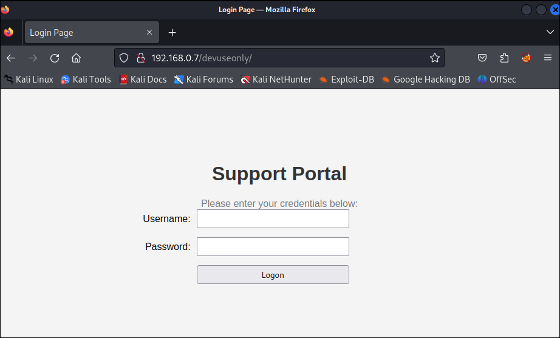
> Figure - Attacker viewing the login portal

At this point the attacker is probably very happy to see that they have discovered the availability of a logon page. While steps that will be taken here will depend on many factors and experience levels, let us assume that the attacker decides to launch a password attack against this form in an attempt to discover valid credentials.

```
──(kali㉿kali)-[~]
└─$ hydra -l admin -P /usr/share/seclists/Passwords/Default-Credentials/default-passwords.txt 192.168.0.7 http-post-form "/devuseonly/post.php:username=^USER^&password=^PASS^&login=":Incorrect
```
> Listing - Attacking attempt to discover valid credentials with hydra

From the attacker perspective, everything will ultimately fail and they will either keep trying or give up. However, from the defender point of view, we have a lot of new data at our disposal now that we can take advantage of. To start, we’ll run another check to see if anyone has accessed our hidden directory.

```
lab@support:~$ grep '/devuseonly/' "/var/log/apache2/access.log" | awk '{print $1}' | sort -u
192.168.0.6
```
> Listing - Identifying an ip address that has accessed devuseonly

In this case someone has stepped into the next level of our honeypot which will warrant more attention on our end. We already know that the only thing that is accessible on this page is a fake login page so we’ll look to see if any credentials have been stored.

```
lab@support:~$ tail -f /var/www/logons.txt
2023-08-23 16:19:27 | Username: admin | Password: RIP000 | Remote IP: 192.168.0.6 | Agent: Mozilla/5.0 (Hydra)
2023-08-23 16:19:29 | Username: admin | Password: 1234admin | Remote IP: 192.168.0.6 | Agent: Mozilla/5.0 (Hydra)
2023-08-23 16:19:31 | Username: tristram@company.com | Password: GrillinNHackin1337 | Remote IP: 192.168.0.6 | Agent: Mozilla/5.0 (Hydra)
```
> Listing - Contents of the logon.txt file with credentials

In this case we can see that the attacker has indeed launched a password attack against our portal which has provided us with the knowledge of the usernames and passwords that they are trying. When you are made aware of credentials being logged, you have immediately learned that an attacker is aggressively trying to validate credentials but more importantly is the last entry in the list which appears to be more a more formalized username for `tristram@company.com` and the password `GrillinNHackin1337`.
 
As a defender we need to actively monitor for changes to this log file to see if any of them appear to be legitimate which could lead to the assumption that Tristram has been phished or otherwise compromised their credentials. At which point the alarms should be raised and incident response procedures should be engaged. In addition to this, we can use the other entries to generate custom wordlists for usernames and passwords that are being used by attackers.

Let’s summarize everything we have learned from this scenario:

**Attacker Perspective**

1. A development/test system has been made accessible to the internet that contains an email address on the landing page
2. A logon portal is accessible from a path disclosed through the use of a robots.txt file
3. We were unable to verify any combination of usernames and passwords that we tried

**Defender Insight**

1. Gained the ability to publish a mailbox that is expected to receive spam and phishing emails that can be assessed and merit a response prior to legit mailboxes receiving messages from the same sender
2. Gained the ability to derive a list of directories that attackers are actively using in their wordlists to discover directories on a web server
3. Gained the ability to derive a list of malicious ip addresses from variable levels of aggressive scanning
4. Gained the ability to derive a list of usernames and passwords that are actively being tried by an attacker that can be used to build your own wordlist of known credentials being used in the while as well as those that may be legitimate credentials from an employee implying they have been compromised

There is a wealth of information that can be made accessible through a well placed and designed web server honeypot. With due care, you could expand upon this use case even further by planting _valid_ credentials that would then reveal functionality to upload files that are saved to the system in a secure manner that are then immediately shipped to VirusTotal. 

## Wrapping Up

In this topic we have enhanced our understanding of honeypots and how we could build one to assist in our awareness and response to cyber security attacks. The opportunities that you can deploy are endless and if we continue to work together and share ideas we will make our industries a safer place.
